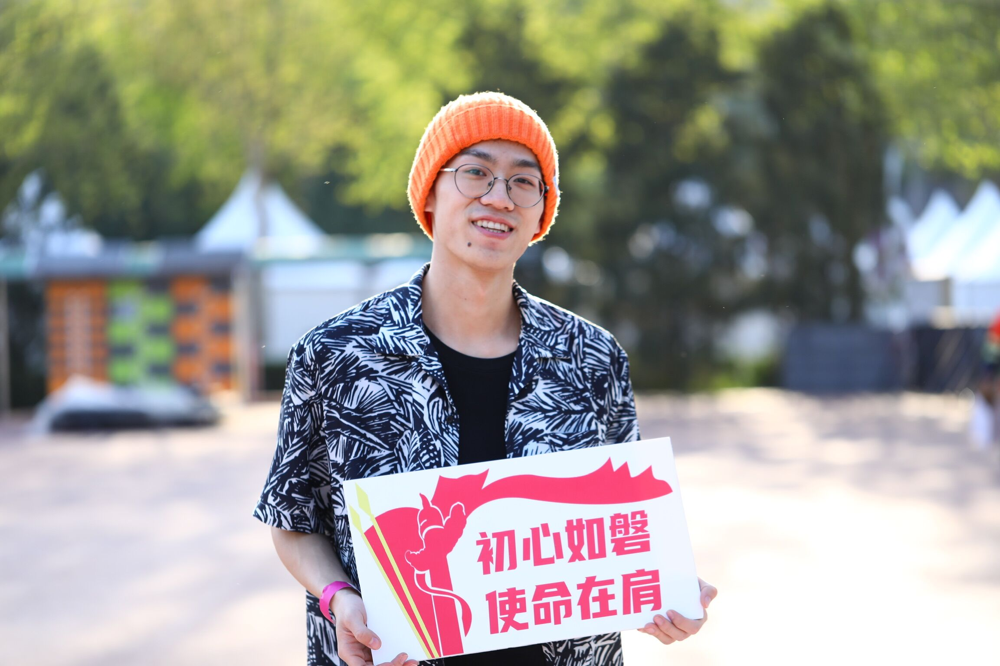

## 个人介绍

**姓名** : 崔竣博 	**专业** : 计算机科学与技术

**学习经历** : 2018.9-2022.1清华大学	2022.2-2023.6首都师范大学

   
    
 
        2018年8月, 因双培计划就读于清华大学计算机系, 在该校三年半的校园时光中, 我在学习上努力保持进取之心, 在组织上积极参加班级活动, 在社团中作为骨干锻炼各方面能力, 在假期投身于社会实践中去, 在科研方面根据自身兴趣曾与任课教师一起编写课程教材.  
        2021年2月, 返回首都师范大学,  完成毕业设计并修读完培养方案剩余课程,  作为清华双培班班长帮助团支书共同协助学校组织同学顺利毕业. 
        其中, 由于个人身体原因在清华就读阶段有半年休学时期, 大四未能完成培养方案,  故延期至大五毕业.
    

    
    
         
    
 

## 学习

**技术栈** : 掌握C\C++\Python语言编写程序, 熟悉linux操作, 对嵌入式开发、深度学习有一定了解

## 经历

**课程项目** : 

1. "嵌入式系统"课程大作业--***优化树莓派上的图像识别深度神经网络***
2. "专业实践"课程项目--***win10/21H1 下实现无限hook***
3. "软件工程"课程大作业--***IM即时通信系统开发***
4. "毕业设计" 课题 -- ***轻量化区块链系统模型设计与实现***

**SRT项目** : 

1. ***"舞蹈实践与创新"课程教材***  第3\10\11\12章的初版编写与校对

**社会实践** :

1. 2019年 ***荣昌安富 暑期支教***
2. 2021年 ***荣昌安富 暑期支教***

**协助项目** :

1. "毕业设计" -- ***泡泡打印机*** 的交互实体的实现

## 课余兴趣

1. 2020-2022	***清华大学学生街舞社DK5骨干***--***Breaking队队长*** 负责带队每周课程与活动编舞
		2019-2022在街舞社期间, 参加和参与创作了 多次新年元旦晚会开场舞, 毕业生晚会表演, 校周年庆晚会表演等诸多演出活动. 

